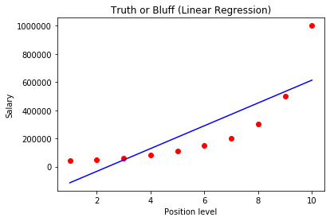
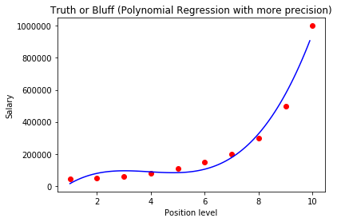

# Bluff Detector
 
*A Bluff Detector machine learning model based on Polynomial Linear Regression. It can be used to identify the bluff which a new employee can made on his past job salary. The model in input takes an experience level and predict the right salary for a given experience / position level.*

### DataSet

Dataset consists of 10 entries of the employees salaries based on their experience/position level.

Linear Regression is a machine learning algorithm based on supervised learning. It performs a regression task. Regression models a target prediction value based on independent variables. It is mostly used for finding out the relationship between variables and forecasting. Different regression models differ based on – the kind of relationship between dependent and independent variables, they are considering and the number of independent variables being used.

### Plots

- *Plot of Salary vs position level using simple linear regression*

---------------------

- *Plot of Salary vs position level using polynomial linear regression*

---------------------

- *Plot of Salary vs position level using polynomial linear regression and high precision*

